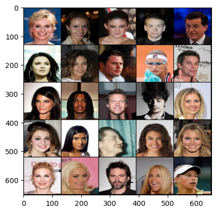

# FaceForge: Advanced GAN for Photorealistic Face Synthesis

## 🌟 Project Overview

FaceForge is a cutting-edge implementation of a Generative Adversarial Network (GAN) designed for high-fidelity face synthesis. This project pushes the boundaries of artificial image generation, creating stunningly realistic human faces that blur the line between artificial and real.

### 🚀 Key Features

- **State-of-the-Art Architecture**: Utilizes advanced GAN techniques including self-attention mechanisms and residual blocks.
- **Conditional Generation**: Capable of generating faces based on specific attributes or classes.
- **High Resolution Output**: Produces high-quality 128x128 pixel images with the potential for even higher resolutions.
- **Stable Training**: Implements techniques to ensure stable and consistent training of both Generator and Critic.

## 🛠 Technical Stack

- **Framework**: PyTorch
- **Language**: Python 3.7+
- **Key Libraries**: torchvision, numpy, matplotlib

## 🏗 Architecture

FaceForge employs a sophisticated architecture for both its Generator and Critic:

### Generator
- Utilizes transposed convolutions for upsampling
- Incorporates residual blocks for improved gradient flow
- Employs self-attention mechanism for long-range dependency modeling

### Critic
- Uses strided convolutions for downsampling
- Features spectral normalization for lipschitz continuity
- Implements a self-attention layer for enhanced feature capture

## 🚦 Getting Started

### Prerequisites
- Python 3.7+
- PyTorch 1.7+
- CUDA-capable GPU (recommended)

### Installation

1. Clone the repository:
   ```
   git clone https://github.com/sohrabsarabian/FaceForge-Advanced-GAN-for-Photorealistic-Face-Synthesis.git
   cd FaceForge
   ```

2. Install required packages:
   ```
   pip install -r requirements.txt
   ```

### Usage

1. Prepare your dataset (we recommend the CelebA dataset).

2. Train the model:
   ```
   python main.py --data_path /path/to/celeba/dataset --n_epochs 200
   ```

3. Generate faces:
   ```
   python generate.py --model_path path/to/your/model.pth --num_images 4 --labels 0,1,2,3
   ```

## 📊 Results



Our model achieves impressive results, generating diverse and realistic faces. The self-attention mechanism allows for coherent global structures, while the residual blocks help in capturing fine details.

## 🔬 Experimentation

FaceForge is designed with experimentation in mind. Key hyperparameters can be easily adjusted:

- Latent space dimension (`--z_dim`)
- Number of channels (`--channels`)
- Learning rate (`--lr`)
- Batch size (`--batch_size`)

We encourage users to experiment with these parameters and observe their effects on the generated images.


## 📜 License

This project is licensed under the MIT License - see the [LICENSE.md](LICENSE.md) file for details.

## 🙏 Acknowledgments

- The CelebA dataset for providing high-quality face images
- The PyTorch team for their excellent deep learning framework
- All contributors and researchers in the field of GANs

---

<p align="center">
  Made with ❤️ by Mohammad Sarabian
</p>
